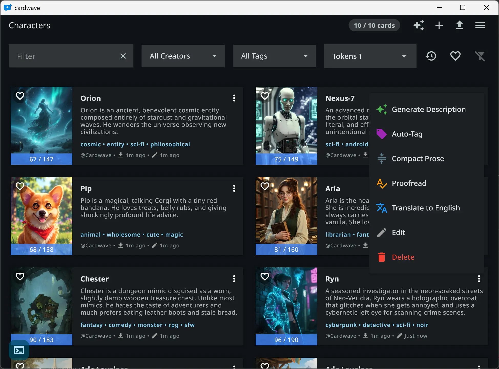

# Cardwave

AI character cards editor + chat. Author SillyTavern-compatible cards, chat with them across multiple LLM providers. Flutter desktop / web / Android.

## Features

- Character card editor (PNG + JSON, SillyTavern format)
- Multi-provider chat: xAI Grok, OpenAI, Anthropic, Gemini, NanoGPT, KoboldCPP (local)
- Image generation, TTS, video generation
- Group chats with multiple characters
- On-device embeddings for character search
- Offline-capable via local LLMs (KoboldCPP)

## Install

- **Windows / Android**: [latest release](https://github.com/elana-voss/cardwave/releases/latest)
- **Web**: https://elana-voss.github.io/cardwave/app/

## Quick start

1. Launch the app
2. Add an LLM provider during onboarding (any supported service)
3. Import a character card (PNG with embedded JSON) or create one
4. Start chatting

## Windows: GPU compatibility

A bug in some recent laptop GPU drivers can crash Cardwave on startup. Cardwave already includes a workaround — no action needed from you.

Affected hardware reported so far:

- NVIDIA GeForce RTX 50-series (Blackwell) laptop GPUs
- AMD Strix Point laptops with integrated Radeon graphics (e.g. Radeon 860M in Ryzen AI 9 HX 370)

If you crash on launch on a different GPU, please open an issue. Driver-bug trackers (for reference): [NVIDIA forum](https://forums.developer.nvidia.com/t/blackwell-rtx-5050-laptop-sm-120-vulkan-driver-crashes-in-cooperative-matrix-property-queries/369162), [AMDVLK #422](https://github.com/GPUOpen-Drivers/AMDVLK/issues/422).

## License & commercial restrictions

This project is **source-available**, not OSI open source.

- **Personal use**: free. Fork, modify, use for yourself or education.
- **Commercial use**: prohibited without explicit written permission. No selling, no Play Store / App Store / Windows Store re-publish, no ad-supported derivatives.
- **Trademarks**: the name "Cardwave" and its logos are unregistered trademarks of Cardwave and are NOT covered by the software license. See [`branding/README.md`](branding/README.md).

See [`LICENSE`](LICENSE) for full text (PolyForm Noncommercial 1.0.0).
